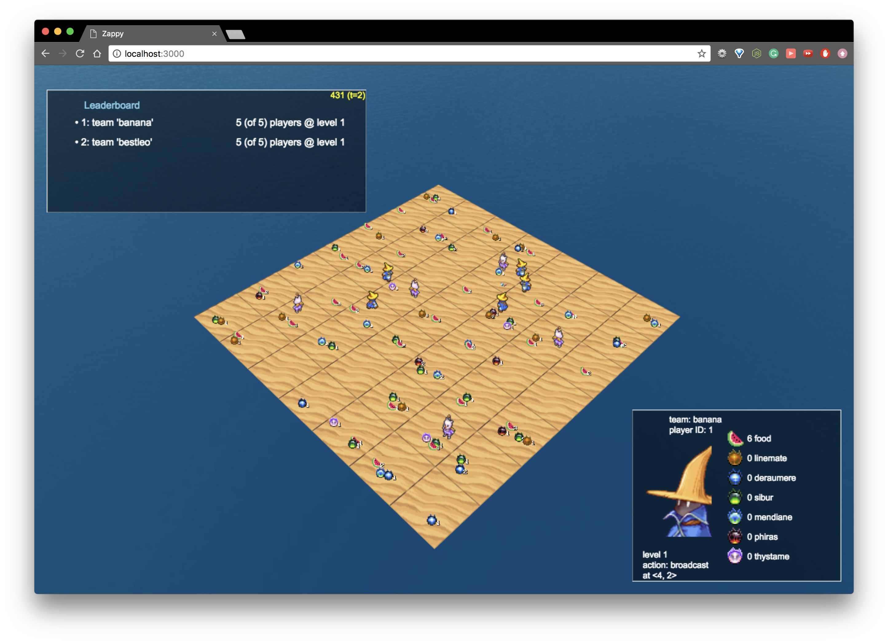

# Zappy ⚡️️️️️️️️⚡️

A multi-players, single process and single thread game within a TCP/IP network 🤖
* **Techinal part**: Zappy is a team project consisting of 5 people creating a world with resources (**the server** written in **C**) with complex AIs (**the clients** written in Python) that have personalities and actions. Server-client and client-client interactions happen through the server on a TCP/IP network which is displayed on **a Graphical Interface** (written in **JavaScript**). The game servers may only utilize **a SINGLE PROCCESS within a SINGLE THREAD**. Interesting parts about Zappy's technical part I'd like to mention about:
  * A time unit taken into consideration in **Event Driven Engine** allows to choose game speed (`-t <timeunit>` while executing server binary). The greater time unit, the faster game goes.
  * We implement a **circular buffer for each player action's queue**, because it has a known maximum (10) and provides a faster acces time.
  * Our GFX is both a Client and a Web Server written in nodejs, the client connects and identify as a Graphic Client after submitting a special token to the Server in C. After we secure the stream of information beetween the Game Engine and our Web server, we use [Babylon.js V3.3](https://github.com/BabylonJS/Babylon.js/releases?after=4.0.0-alpha.5), a javascript 3D Engine, to render the Game World in your browser and to update the information we use [Socket.io](https://github.com/socketio/socket.io) to enable a real-time bidirectional communication. Thank to this design we can host the Graphic Server in one computer and be able to have **Multiple Graphical Client** in differents computers just by connection to the&nbsp;`<computer-ip>:<port>` in your browser.
  </br>
* **Fun part**: Zappy is about creating families, surviving by eating food and collecting stones in order to level up. Each level has different requirements for a ritual, which makes the adventure more and more difficult for the AI players, which play on their own, without any help form their creator. The game is over once 6 members of one family reach the highest possible level (8).
</br></br>



</br></br>

# How to run Zappy?
```
git clone https://github.com/LeoTD/Zappy.git Zappy
cd Zappy
make
cd bin
```
* In case you want to virtualize the server and put it in a container or you just happen to be using a debian based distribution you can use our **[Debian Built](https://github.com/LeoTD/Zappy/tree/debian_built)** ⚡️

1. Open a window and **run the server** under server's usage:
```
$ ./server
Usage: ./server -p <port> -x <width> -y <height> -n <team> [<team>] [<team>] ... -c <nb> [-t <t>]
-p port number
-x world width
-y world height
-n team_name_1 team_name_2 ...
-c number of clients authorized at the beginning of the game
-t [100] time unit divider (the greater t is, the faster the game will go)
```
* for example you can run this line to execute a basic server
```
./server -p 4242 -x 10 -y 10 -n banana bestleo -c 5 -t 1 &
```
* The '&' is optional is just gonna run the server in background so you don't have to open a new terminal for the next step 😅
</br>

2. Run an **AI client**, you can use ours, here's how:
```
$ ./client
usage: ./client -n <team> -p <port> [-h <hostname>]
-n team_name
-p port
-h name of the host, by default it'll be localhost
```
* A basic example:
```
./client -n banana -p 4242 -h localhost
```
* Pick your team wisely ⚡️
* If you have time you may want to try to play as a mortal by &nbsp;``` nc <server's name> <port>``` , after the &nbsp;```WELCOME```&nbsp; message you might pick your **TeamName**, of course you will have to memorized this **[commands](#commands)**

</br>

3. Run the **Web GUI Client**; in a new window if you didn't send the AI to background:
```
$ ./gfx
Usage:
With two arguments, './gfx <zappy-server-hostname> <zappy-server-port>'
With one argument, './gfx <zappy-server-port>' (and assume that host='localhost')
This client can be started before the server spins up, in which case it will wait until the server is ready.
```
* It can wait for your server to start so you can start the **gfx** first if you want to, i.e:
```
$ ./gfx localhost 4242
Waiting for localhost:4242
```
* It will open a tab of your browser with the host of where you are running your **GFX** in the **port 3000**, if the automatic tab don't work, you can connect to &nbsp;```<host>:<port> ```&nbsp; | ex.&nbsp;```localhost:3000```
* The GUI will have a leaderboard, and you will be able to **Click on Players, to see their details**
* Here's a list of actions available within the Graphic Client:

| Buttons | Action |
|:-:|:-:|
| ← \| ↑ \| →  \| ↓ | Move Camera |
| + \| - | Zoom in / out |

 4. **(OPTIONAL)** Add more players **repeat**ing **step 2 N times** - the more players, the more fun 👯⚡️!
</br></br>

## Rules:
* Each player starts with 10 food (1260 time units) and 0 stones.
* Each player starts on level 1.
* The higher level, greater sight range.
* One food == 126 time units.
* Eat to not starve, collect stones to level up.
* Hatch an egg if you need a spot in your family.
* Create family (of at least 6) and win the game.
</br></br>

## Commands

Each player is allowed to use following commands:

| Command | Time | Description |
|:-:|:-:|:-:|
| advance | 7 | advance one square |
| left | 7 | turn 90 degrees left |
| right | 7 | turn 90 degrees right |
| see | 7 | see what's in your sight <br /> (range depends on your level) |
| inventory | 1 | look into your inventory |
| take \<object> | 7 | take an object to your inventory |
| put \<object> | 7 | drop an object from your inventory |
| kick | 7 | kick the players form your square |
| broadcast \<text> | 7 | send a message to all players |
| incantation | 300 | begin the ritual of incantation |
| fork | 42 | lay an agg and create additional spot in a family |
| connect_nbr | 0 | number of unused connection within a family |
 
 </br>
  
## Incantation
In order to win you and your family member have to achieve level 8 (at least 6 family members) by collection stones and having an incantation ritual. These stones have 6 distinct kinds: linemate, deramere, sibur, mendiane, phiras and thystame.
Each level has different ritual requirements:

| Level | Number of players | Linemate | Deraumere | Sibur | Mendiane | Phiras | Thystame |
|:-:|:-:|:-:|:-:|:-:|:-:|:-:|:-:|
| 1-2 | 1 | 1 | 0 | 0 | 0 | 0 | 0 |
| 2-3 | 2 | 1 | 1 | 1 | 0 | 0 | 0 |
| 3-4 | 2 | 2 | 0 | 1 | 0 | 2 | 0 |
| 4-5 | 4 | 1 | 1 | 2 | 0 | 1 | 0 |
| 5-6 | 4 | 1 | 2 | 1 | 3 | 0 | 0 |
| 6-7 | 6 | 1 | 2 | 3 | 0 | 1 | 0 |
| 7-8 | 6 | 2 | 2 | 2 | 2 | 2 | 1 |

</br>

# Made by
| | |
|:-:|:-:|
| 🇺🇸 [Joshua Gelbard](https://github.com/joshgelbard) | Server / GUI |
| 🇨🇴 [Leonardo Tanenba](https://github.com/LeoTD) | Server / GUI |
| 🇺🇸 [Ezekiel Liu](https://github.com/eliu42) | Server / GUI |
| 🇨🇦 [Maksym Moros](https://github.com/maxmoros)| Server / AI |
| 🇵🇪 [Gerardo Malpartida](https://github.com/regien)| Server / GUI |
| | |
</br>

